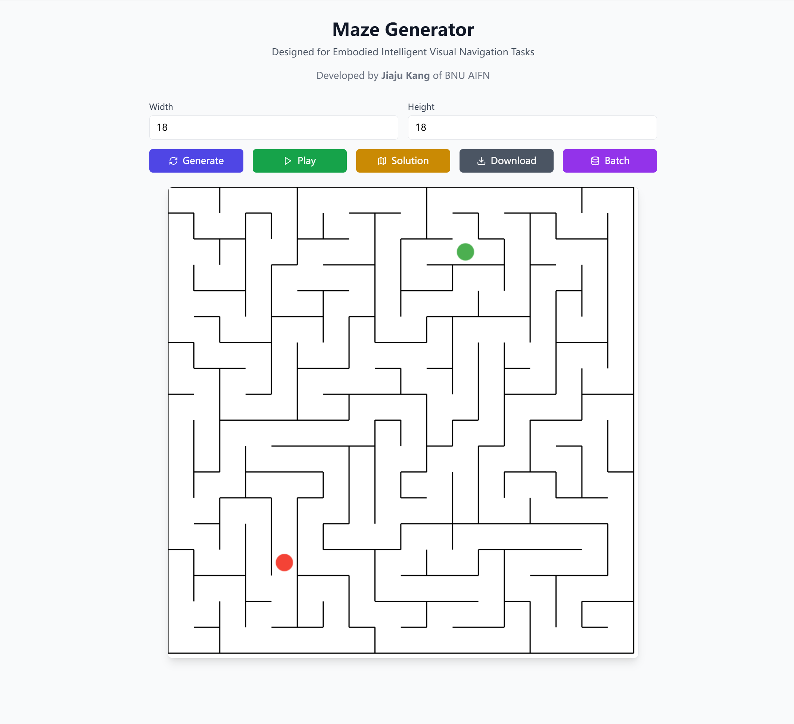
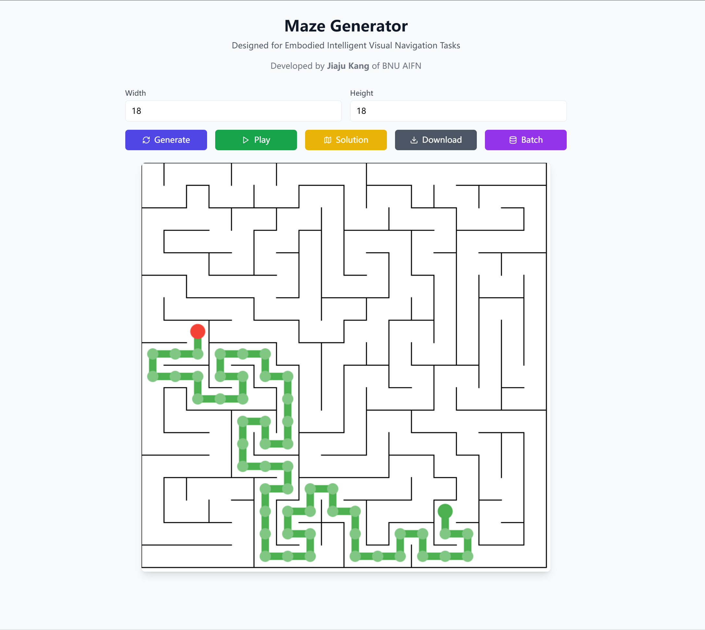
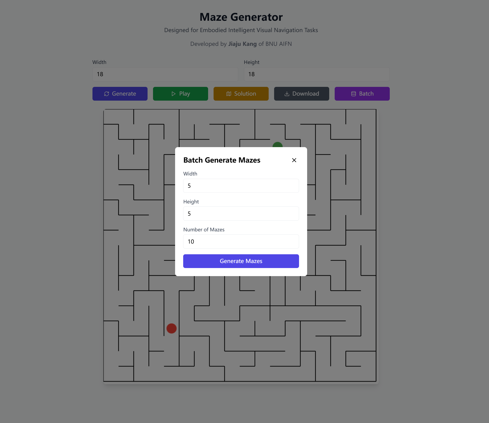

# Maze-Generator
Maze Generator is Designed for Embodied Intelligent Visual Navigation Tasks



## Project Overview
This project contains a maze generator that creates perfect mazes and corresponding solutions. The generated mazes and solutions are used as training data for robot 2D vision path planning tasks. The dataset provides complex maze environments that help robots improve path planning efficiency and accuracy.

Developed by **Jiaju Kang** of **Institute for Artificial Intelligence and Future Networks in Beijing Normal University **.


## Getting Started
You can directly run this project in your browser using the following link:

[Run the Project on StackBlitz](https://stackblitz.com/~/github.com/kangjiaju/Maze-Generator)

## How to Use
- **Interactive Gameplay**: Navigate the maze using arrow keys to move the ball from the starting point (green) to the endpoint (red).
- **Maze Solution**: Generate and display a solution path using the A* algorithm by clicking the "Solution" button.
- 
- **Customizable Size**: Users can specify the width and height of the maze before generation.
- **Download Data**: Export the current maze and its solution as a file with the "Download" button.
- **Batch Maze Generation**: Generate and export multiple mazes at once using the "Batch" button, ideal for dataset creation.
-  

## Contributing
Contributions are welcome! If you’d like to add new features, improve functionality, or fix bugs, please open a pull request on GitHub.

## Citation
If you use this project in your research or work, please cite it as follows:

```
@misc{kang2024maze,
  author = {Jiaju Kang},
  title = {Maze Generator for Embodied Intelligent Visual Navigation Tasks},
  year = {2024},
  url = {https://github.com/kangjiaju/Maze-Generator},
  note = {GitHub repository}
}
```

## License
This project is licensed under the MIT License.
